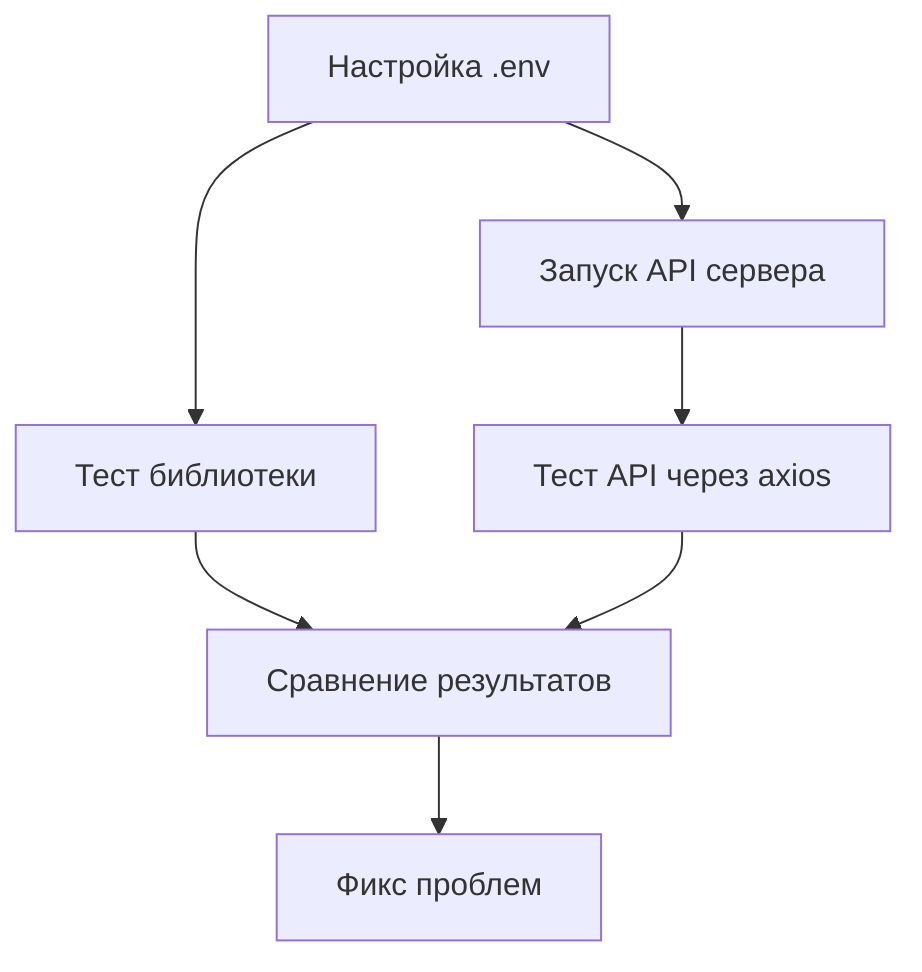

# TASK-001: Проверка работоспособности (библиотека + API)

**Создан:** 2026-02-19 14:30
**Приоритет:** 🔥 Высокий
**Оценка:** 2 часа
**Статус:** 🚧 В работе

---

## Описание задачи

Комплексная проверка работоспособности проекта в двух режимах:
1. **Библиотека** — использование `client.js` напрямую в Node.js коде
2. **API Proxy** — HTTP сервер через `index.js`

Цель: убедиться что оба режима работают корректно, задокументировать проблемы, обновить тесты.

---

## Анализ и декомпозиция

### Основные компоненты

#### Режим 1: Библиотека
- `client.js` — основной класс K2ThinkClient
- `auth_manager.js` — аутентификация и токены
- Примеры: `examples/library_usage.js`, `examples/simple_chat.js`

#### Режим 2: API Proxy
- `index.js` — HTTP сервер
- `server.js` — конфигурация Express
- `auth_manager.js` — общая аутентификация
- Тест: `simple_test.js`

### Зависимости



---

## План выполнения

### Этап 1: Подготовка

#### 1.1 Проверка конфигурации окружения
- 📁 Файлы: `.env.example`, `.env`
- 🔧 Команда: `cp .env.example .env` (если нет)
- ⏱️ Оценка: 5 мин
- ✅ Результат: `.env` с тестовыми credentials

**Проверить:**
```bash
ls -la .env || echo "NEED TO CREATE"
```

#### 1.2 Анализ существующих тестов
- 📁 Файлы: `simple_test.js`, `basic_test.js`, `final_test.js`, `test_library.js`
- 🔧 Команда: `grep -l "test" *.js examples/*.js`
- ⏱️ Оценка: 10 мин
- 📝 Результат: Список работающих тестов

---

### Этап 2: Тестирование библиотеки

#### 2.1 Запуск примера library_usage.js
- 📁 Файл: `examples/library_usage.js`
- 🔧 Команда: `node examples/library_usage.js`
- ⏱️ Оценка: 15 мин
- ✅ Критерий: Успешный ответ от API

**Ожидаемый результат:**
```javascript
const K2ThinkClient = require('../client');
const client = new K2ThinkClient();
const response = await client.chat.completions.create({...});
console.log(response.choices[0].message.content);
```

#### 2.2 Запуск simple_chat example
- 📁 Файл: `examples/simple_chat.js`
- 🔧 Команда: `node examples/simple_chat.js`
- ⏱️ Оценка: 15 мин
- ✅ Критерий: Диалог работает

#### 2.3 Проверка conversation.js (контекст)
- 📁 Файл: `examples/conversation.js`
- 🔧 Команда: `node examples/conversation.js`
- ⏱️ Оценка: 15 мин
- ✅ Критерий: Контекст сохраняется

#### 2.3a Создание интеграционного теста библиотеки
- 📁 Файл: `tests/library_integration.test.js`
- ⏱️ Оценка: 30 мин
- ✅ Критерий: Тест проверяет все сценарии

**Тест должен проверять:**
- [ ] Простой запрос (один вопрос)
- [ ] Контекстный запрос (несколько сообщений)
- [ ] Получение списка моделей
- [ ] Обработку ошибок аутентификации
- [ ] Автоматический refresh токена

---

### Этап 3: Тестирование API Proxy

#### 3.1 Запуск сервера
- 📁 Файл: `index.js`
- 🔧 Команда: `npm start &` или `node index.js &`
- ⏱️ Оценка: 5 мин
- ✅ Критерий: Сервер слушает порт 3000

**Проверить:**
```bash
curl http://localhost:3000/
```

#### 3.2 Health check endpoint
- 🔧 Команда: `curl http://localhost:3000/`
- ⏱️ Оценка: 5 мин
- ✅ Критерий: Возвращает статус OK

#### 3.3 GET /v1/models
- 🔧 Команда: `curl http://localhost:3000/v1/models`
- ⏱️ Оценка: 5 мин
- ✅ Критерий: Список моделей в формате OpenAI

#### 3.4 POST /v1/chat/completions (простой запрос)
- 🔧 Команда:
```bash
curl -X POST http://localhost:3000/v1/chat/completions \
  -H "Content-Type: application/json" \
  -d '{"model":"MBZUAI-IFM/K2-Think","messages":[{"role":"user","content":"Hello"}]}'
```
- ⏱️ Оценка: 10 мин
- ✅ Критерий: Ответ в формате OpenAI

#### 3.5 POST /v1/chat/completions (контекст)
- 🔧 Команда: curl с массивом сообщений
- ⏱️ Оценка: 10 мин
- ✅ Критерий: Контекст сохраняется

#### 3.5a Создание интеграционного теста API
- 📁 Файл: `tests/api_integration.test.js`
- ⏱️ Оценка: 30 мин
- ✅ Критерий: Тест проверяет все endpoints

**Тест должен проверять:**
- [ ] Health check GET /
- [ ] List models GET /v1/models
- [ ] Chat completion POST /v1/chat/completions (простой)
- [ ] Chat completion с контекстом
- [ ] Обработку ошибок (400, 401, 500)
- [ ] CORS headers

---

### Этап 4: Сравнение и документирование

#### 4.1 Сравнение режимов
- 📝 Файл: `docs/modes_comparison.md`
- ⏱️ Оценка: 20 мин
- ✅ Критерий: Таблица с отличиями

**Сравнить:**
- Производительность
- Удобство использования
- Обработку ошибок
- Поддержку контекста

#### 4.2 Обновление README
- 📝 Файл: `README.md`
- 🔧 Добавить секцию "Testing"
- ⏱️ Оценка: 15 мин
- ✅ Критерий: Инструкции по тестированию

#### 4.3 Обновление QUICKSTART
- 📝 Файл: `QUICKSTART.md`
- 🔧 Добавить примеры тестов
- ⏱️ Оценка: 15 мин
- ✅ Критерий: Быстрый старт с тестами

---

### Этап 5: Фикс проблем (если найдены)

#### 5.1 Исправление ошибок библиотеки
- 📁 Файлы: `client.js`, `auth_manager.js`
- ⏱️ Оценка: 30 мин
- ✅ Критерий: Все тесты бибилиотеки проходят

#### 5.2 Исправление ошибок API
- 📁 Файлы: `index.js`, `server.js`, `auth_manager.js`
- ⏱️ Оценка: 30 мин
- ✅ Критерий: Все тесты API проходят

---

## MCP инструменты для задачи

### Обязательные
- ✅ **Playwright** — для тестирования HTTP endpoints (альтернатива curl)
- ✅ **Perplexity** — поиск best practices для тестирования API

### По необходимости
- ⚙️ **Filesystem** — для операций с файлами
- ⚙️ **GitHub** — для создания PR после завершения

---

## Прогресс выполнения

**Общий прогресс:** [░░░░░░░░░░] 0/17 задач (0%)

### Этап 1: Подготовка ⏳
[░░] 0/2 (0%)
- [ ] 1.1 Проверка .env
- [ ] 1.2 Анализ тестов

### Этап 2: Тестирование библиотеки ⏳
[░░░░░] 0/4 (0%)
- [ ] 2.1 library_usage.js
- [ ] 2.2 simple_chat.js
- [ ] 2.3 conversation.js
- [ ] 2.3a Integration test

### Этап 3: Тестирование API ⏳
[░░░░░░░] 0/6 (0%)
- [ ] 3.1 Запуск сервера
- [ ] 3.2 Health check
- [ ] 3.3 GET /v1/models
- [ ] 3.4 POST chat (простой)
- [ ] 3.5 POST chat (контекст)
- [ ] 3.5a API integration test

### Этап 4: Документирование ⏳
[░░░] 0/3 (0%)
- [ ] 4.1 Modes comparison
- [ ] 4.2 Обновление README
- [ ] 4.3 Обновление QUICKSTART

### Этап 5: Фикс проблем ⏳
[░░] 0/2 (0%)
- [ ] 5.1 Fix library bugs
- [ ] 5.2 Fix API bugs

---

## Заметки и проблемы

### [Дата Время] — Проблема с [...]
Описание: [что пошло не так]
Решение: [как исправили]
MCP использован: [какой инструмент помог]

---

## Git коммиты для задачи

После выполнения каждого пункта — сразу коммит!

```
feat(tests): Add library integration tests
test(library): Test all client methods
fix(client): Handle token refresh correctly
feat(tests): Add API integration tests
docs: Update README with testing instructions
```

---

## Критерии завершения

✅ Задача считается завершенной когда:
- [ ] Все чекбоксы отмечены
- [ ] Библиотека работает (все примеры)
- [ ] API работает (все endpoints)
- [ ] Интеграционные тесты написаны
- [ ] Документация обновлена
- [ ] Код закоммичен с правильными сообщениями
- [ ] Файл перемещен в `docs/tasks/completed/`

---

## Переменные окружения для тестирования

Создать `.env.test` с тестовыми credentials:

```env
K2THINK_API_BASE=https://www.k2think.ai
K2THINK_EMAIL=test@example.com
K2THINK_PASSWORD=test-password
PORT=3000
LOG_LEVEL=debug
```

**Внимание:** Для реального тестирования нужны действительные credentials от K2Think.ai
