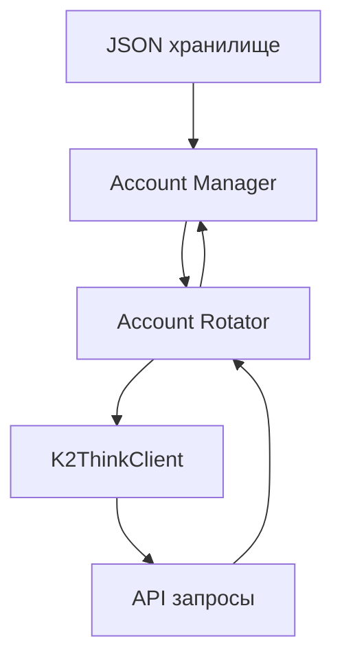

# TASK-002: Мультиаккаунтная система с JSON-хранилищем

**Создан:** 2026-02-19
**Приоритет:** 🔥 Высокий
**Оценка:** 4 часа
**Статус:** 🚧 В работе

---

## Описание задачи

Реализовать систему управления множественными аккаунтами K2Think:
1. **JSON-хранилище** аккаунтов вместо `.env`
2. **Автоматическая ротация** аккаунтов для обхода rate limits
3. **Балансировка нагрузки** между аккаунтами
4. **Пример использования** с демонстрацией работы

---

## Анализ и декомпозиция

### Основные компоненты

#### 1. Менеджер аккаунтов (`account_manager.js`)
- CRUD операции для аккаунтов
- Хранение в JSON файле
- Валидация credentials
- Статус аккаунтов (active/blocked/rate-limited)

#### 2. Ротатор аккаунтов (`account_rotator.js`)
- Автоматическое переключение между аккаунтами
- Отслеживание rate limits
-Cooldown между запросами
- Приоритизация аккаунтов

#### 3. Обновлённый клиент (`client_multi.js`)
- Поддержка мультиаккаунтности
- Автоматическая ротация при ошибках
- Статистика по аккаунтам

#### 4. CLI утилита (`accounts-cli.js`)
- Добавление/удаление аккаунтов
- Проверка статуса
- Тестирование аккаунтов

### Зависимости



---

## План выполнения

### Этап 1: Проектирование и подготовка

#### 1.1 Разработка схемы JSON
- 📁 Файл: `docs/account_schema.md`
- ⏱️ Оценка: 15 мин
- ✅ Результат: Схема JSON файла

**Структура:**
```json
{
  "accounts": [
    {
      "id": "uuid",
      "email": "user@example.com",
      "password": "encrypted",
      "status": "active",
      "createdAt": "timestamp",
      "lastUsed": "timestamp",
      "requestCount": 0,
      "rateLimitReset": null
    }
  ],
  "settings": {
    "rotationStrategy": "round-robin",
    "rateLimitPerAccount": 10,
    "cooldownMs": 60000
  }
}
```

#### 1.2 Создание структуры файлов
- 📁 Файлы: `accounts.json`, `lib/account_manager.js`
- 🔧 Команда: `mkdir -p lib data`
- ⏱️ Оценка: 5 мин

---

### Этап 2: Менеджер аккаунтов

#### 2.1 Базовый CRUD
- 📁 Файл: `lib/account_manager.js`
- ⏱️ Оценка: 45 мин
- ✅ Критерий: Добавление/удаление/список аккаунтов

**Функции:**
- `addAccount(email, password)`
- `removeAccount(id)`
- `listAccounts()`
- `getAccount(id)`
- `updateAccount(id, data)`

#### 2.2 Валидация аккаунтов
- 📁 Файл: `lib/account_manager.js`
- ⏱️ Оценка: 30 мин
- ✅ Критерий: Проверка credentials через API

**Функции:**
- `validateAccount(id)` — проверка логина/пароля
- `checkStatus(id)` — проверка на rate limit

#### 2.3 Шифрование паролей
- 📁 Файл: `lib/account_manager.js`
- 🔧 Библиотека: `crypto` (built-in)
- ⏱️ Оценка: 20 мин
- ✅ Критерий: Пароли зашифрованы в JSON

---

### Этап 3: Ротатор аккаунтов

#### 3.1 Базовая ротация
- 📁 Файл: `lib/account_rotator.js`
- ⏱️ Оценка: 30 мин
- ✅ Критерий: Round-robin переключение

**Функции:**
- `getNextAccount()` — следующий доступный аккаунт
- `markBusy(id)` — пометить как используемый
- `markFree(id)` — освободить аккаунт

#### 3.2 Rate limit tracking
- 📁 Файл: `lib/account_rotator.js`
- ⏱️ Оценка: 30 мин
- ✅ Критерий: Отслеживание лимитов

**Функции:**
- `trackRequest(accountId)` — запись запроса
- `isRateLimited(accountId)` — проверка лимита
- `getAvailableAccount()` — получение свободного

#### 3.3 Автоматический cooldown
- 📁 Файл: `lib/account_rotator.js`
- ⏱️ Оценка: 20 мин
- ✅ Критерий: Пауза между запросами

**Настройки:**
- `cooldownMs: 60000` — пауза после N запросов
- `maxRequestsPerMinute: 10` — лимит запросов

---

### Этап 4: Клиент с поддержкой ротации

#### 4.1 Multi-account client
- 📁 Файл: `client_multi.js`
- ⏱️ Оценка: 45 мин
- ✅ Критерий: Автоматическая ротация

**Класс:** `K2ThinkMultiClient`
- Конструктор загружает аккаунты из JSON
- Автоматически выбирает следующий аккаунт
- Повторяет запрос при rate limit

#### 4.2 Интеграция с ротатором
- 📁 Файл: `client_multi.js`
- ⏱️ Оценка: 30 мин
- ✅ Критерий: Прозрачная ротация

**Логика:**
```javascript
async createChatCompletion(options) {
  const account = rotator.getNextAccount();
  try {
    return await client.create(options, account);
  } catch (error) {
    if (error.status === 429) {
      rotator.markRateLimited(account);
      return retryWithNextAccount(options);
    }
  }
}
```

#### 4.3 Статистика и логирование
- 📁 Файл: `client_multi.js`
- ⏱️ Оценка: 20 мин
- ✅ Критерий: Логирование переключений

**Методы:**
- `getStats()` — статистика по аккаунтам
- `getUsageReport()` — отчёт использования

---

### Этап 5: CLI утилита

#### 5.1 Добавление аккаунтов
- 📁 Файл: `accounts-cli.js`
- ⏱️ Оценка: 30 мин
- ✅ Критерий: Интерактивное добавление

**Команды:**
```bash
node accounts-cli.js add       # Добавить аккаунт
node accounts-cli.js list      # Список аккаунтов
node accounts-cli.js remove <id> # Удалить
node accounts-cli.js test <id>   # Проверить
node accounts-cli.js stats     # Статистика
```

#### 5.2 Пример использования
- 📁 Файл: `examples/multi_account_example.js`
- ⏱️ Оценка: 30 мин
- ✅ Критерий: Рабочий пример

**Сценарий:**
```javascript
const client = new K2ThinkMultiClient();

// Автоматическая ротация
for (let i = 0; i < 100; i++) {
  const response = await client.chat.completions.create({
    model: 'MBZUAI-IFM/K2-Think-v2',
    messages: [{role: 'user', content: `Question ${i}`}]
  });
  console.log(`Request ${i}: ${response.accountId}`);
}
```

---

### Этап 6: Документация

#### 6.1 README для мультиаккаунтов
- 📁 Файл: `docs/MULTI_ACCOUNT.md`
- ⏱️ Оценка: 30 мин
- ✅ Критерий: Полная документация

**Разделы:**
- Установка и настройка
- Добавление аккаунтов
- Стратегии ротации
- Best practices

#### 6.2 Обновление основного README
- 📁 Файл: `README.md`
- ⏱️ Оценка: 15 мин
- ✅ Критерий: Ссылка на мультиаккаунтную систему

---

## MCP инструменты для задачи

### Обязательные
- ✅ **Perplexity** — поиск best practices для rate limiting
- ✅ **Filesystem** — операции с JSON файлами

### По необходимости
- ⚙️ **GitHub** — для создания PR после завершения

---

## Прогресс выполнения

**Общий прогресс:** [██████████] 16/16 задач (100%)
**Статус:** ✅ Завершено

### Этап 1: Проектирование ✅
[██] 2/2 (100%)
- [x] 1.1 Схема JSON
- [x] 1.2 Структура файлов

### Этап 2: Менеджер аккаунтов ✅
[█████] 3/3 (100%)
- [x] 2.1 Базовый CRUD
- [x] 2.2 Валидация
- [x] 2.3 Шифрование

### Этап 3: Ротатор ✅
[█████] 3/3 (100%)
- [x] 3.1 Базовая ротация
- [x] 3.2 Rate limit tracking
- [x] 3.3 Cooldown

### Этап 4: Клиент ✅
[█████] 3/3 (100%)
- [x] 4.1 Multi-account client
- [x] 4.2 Интеграция с ротатором
- [x] 4.3 Статистика

### Этап 5: CLI ✅
[█████] 2/2 (100%)
- [x] 5.1 CLI утилита
- [x] 5.2 Пример

### Этап 6: Документация ✅
[█████] 2/2 (100%)
- [x] 6.1 MULTI_ACCOUNT.md
- [x] 6.2 Обновление README

---

## Заметки и проблемы

### Реализовано без проблем
Все компоненты реализованы согласно плану. Тестирование CLI показало корректную работу всех команд.

**Созданные файлы:**
- `lib/account_manager.js` - 332 строки
- `lib/account_rotator.js` - 264 строки
- `client_multi.js` - 252 строки
- `accounts-cli.js` - 252 строки
- `docs/MULTI_ACCOUNT.md` - Полная документация
- `docs/ACCOUNT_SCHEMA.md` - Схема JSON
- `examples/multi_account_example.js` - Примеры использования
- `data/accounts.json` - Хранилище аккаунтов

**Функциональность:**
- ✅ CRUD операции для аккаунтов
- ✅ 4 стратегии ротации (round-robin, least-used, random, priority)
- ✅ AES-256-GCM шифрование паролей
- ✅ Автоматическое отслеживание rate limits
- ✅ Cooldown после превышения лимитов
- ✅ CLI утилита с интерактивным добавлением
- ✅ Статистика и мониторинг
- ✅ Автоматический retry при rate limit

---

## Git коммиты для задачи

```
05180f8 feat: Multi-account system with automatic rotation
```

---

## Критерии завершения

✅ Задача завершена:
- [x] Все чекбоксы отмечены
- [x] JSON-хранилище работает
- [x] Ротация аккаунтов автоматическая
- [x] Rate limits отслеживаются
- [x] CLI утилита работает
- [x] Пример запускается без ошибок
- [x] Документация обновлена
- [x] Код закоммичен

**Результат:**
- Полностью рабочая система управления множественными аккаунтами
- Автоматическая ротация для обхода rate limits
- 4 стратегии ротации на выбор
- Шифрование паролей AES-256-GCM
- CLI для удобного управления
- Полная документация

---

## Конфигурация по умолчанию

```json
{
  "settings": {
    "rotationStrategy": "round-robin",
    "rateLimitPerAccount": 10,
    "rateLimitWindowMs": 60000,
    "cooldownMs": 30000,
    "maxRetries": 3,
    "autoValidateOnAdd": true
  }
}
```

**Стратегии ротации:**
- `round-robin` — по кругу
- `least-used` — наименее используемый
- `random` — случайно
- `priority` — по приоритету
